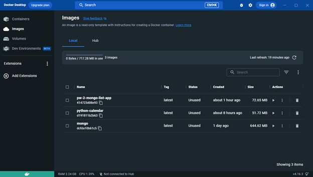

# Практическая работа 2

Содержит файл docker-compose для конфигурации нескольких контейнеров. Содержит папку "application" с программой (main.py и Dockerfile). Программа выводит перечень баз данных mongo

docker-compose:
- описывает два сервиса (программа и mongo), взаимодействующих друг с другом
- собирает образ "app" из папки "application"
- скачивает образ "mongo" из DockerHub
- создает и запускает контейнеры в связке

