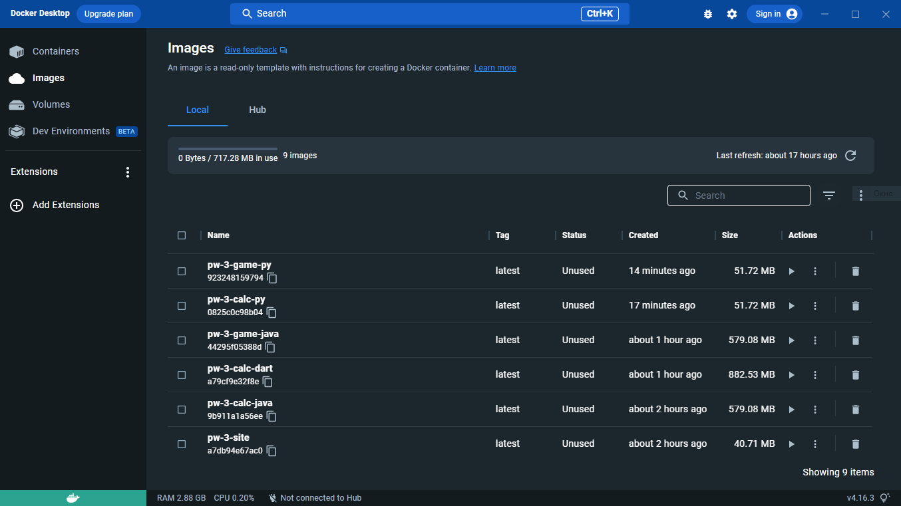

# Практическая работа 3

Содержит папки с отдельными проектами, каждый из которых имеет свой собственный Dockerfile для сборки и запуска контейнеров с ними:

1. Калькулятор на Java
2. Калькулятор на Python
3. Калькулятор на Dart
4. Игра на Java (холодно-горячо)
5. Игра на Python (камень-ножницы-бумага)
6. Веб-сайт (статичные HTML-страницы)

